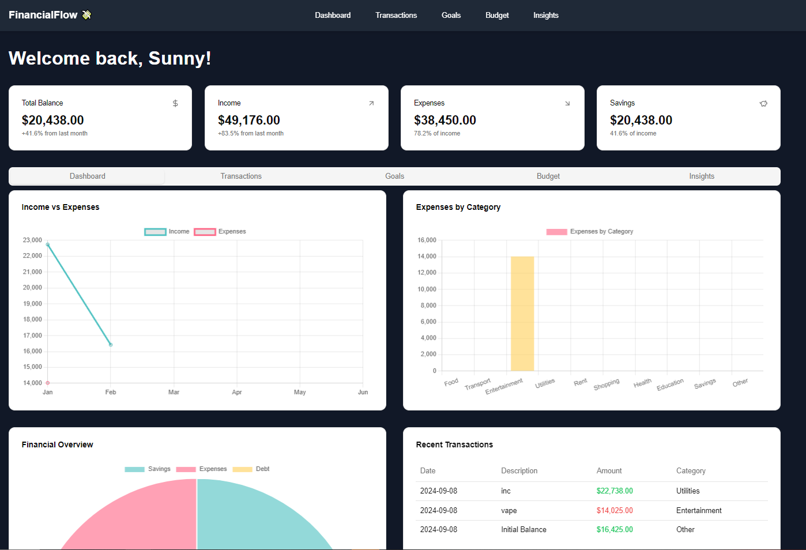
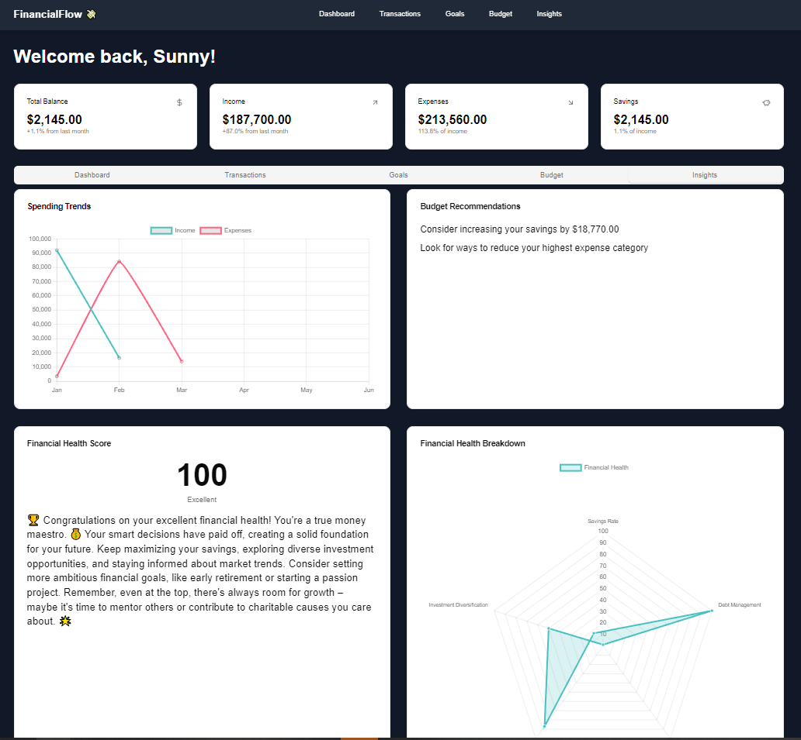

# FinancialFlow 💸

## Table of Contents
1. [Introduction](#introduction)
2. [Architecture Overview](#architecture-overview)
3. [Technology Stack](#technology-stack)
4. [Key Features and Implementation](#key-features-and-implementation)
5. [State Management](#state-management)
6. [Data Persistence](#data-persistence)
7. [UI Components](#ui-components)
8. [Charts and Visualizations](#charts-and-visualizations)
9. [Performance Optimizations](#performance-optimizations)
10. [Security Considerations](#security-considerations)
11. [Testing Strategy](#testing-strategy)
12. [Future Enhancements](#future-enhancements)
13. [Contributing](#contributing)
14. [License](#license)
15. [Contact](#contact)

## 1. Introduction

**FinancialFlow 💸** is a personal finance web app built to help users track their income, expenses, savings, and goals, all while visualizing financial data with rich, interactive charts 📊. This app aims to give users control over their financial health by offering deep insights and customizable tracking features.

## 2. Architecture Overview

The architecture of FinancialFlow is primarily based on **Next.js** for server-side rendering and routing. It uses **Typescript** to build reusable components and **Framer Motion** for smooth animations. Data visualizations are powered by **Chart.js**, and persistent data is handled through **local storage**.

### Key Highlights:
- **Frontend**: Built with **Typescript** and **Next.js** for fast and responsive experiences.
- **State Management**: Implemented using React Hooks (`useState`, `useEffect`) for local state.
- **Modular UI**: Reusable components ensure scalability and maintainability.
- **Animations**: Powered by **Framer Motion** for smooth transitions.

## 3. Technology Stack

The application leverages modern technologies to deliver an intuitive user experience:

- **Framework**: Next.js (Typescript)
- **State Management**: React hooks (`useState`, `useEffect`)
- **Charts**: Chart.js for interactive data visualizations
- **Icons**: Lucide-react for icons throughout the UI
- **Styling**: Tailwind CSS and CSS modules for clean and responsive styling
- **Local Storage**: Persistent data storage on the client side

## 4. Key Features and Implementation

### ✨ **Income and Expense Tracking**:
- Users can log transactions, which are immediately reflected in their balance and monthly summaries.
  
### 🛠 **Budget Management**:
- Users can define budget limits for different spending categories and monitor their actual spending against those limits.

### 🎯 **Goal Setting**:
- Set long-term financial goals (e.g., saving for a house) and track progress using a visual goal tracker.

### 📊 **Data Visualization**:
- Multiple chart types (Line, Bar, Doughnut, and Radar) give users a visual representation of income, expenses, and savings over time.

### 💰 **Financial Health Score**:
- The app calculates a financial health score based on the user's spending, savings, and debt ratios. This score is dynamically updated as the user's financial habits change.

## 5. State Management

State management in **FinancialFlow** is handled using React's `useState` and `useEffect` hooks to manage key application states:
- **balance**: Current balance of the user.
- **income** & **expenses**: Income and expense data for the current period.
- **transactions**: An array holding all the transactions (income/expenses) added by the user.
- **goals**: An array tracking user-defined financial goals.
- **budgetCategories**: An array representing different spending categories, each with a defined budget limit.

The app ensures a reactive UI, updating in real-time when users input new data.

## 6. Data Persistence

FinancialFlow uses the browser's **local storage** for persistent data. This ensures that user data (balance, income, transactions, etc.) is retained across sessions without the need for user accounts. Key data stored includes:
- User's initial balance, income, and monthly expenses.
- All transactions (income and expenses).
- Defined goals and budgets.

Data is read from local storage on app load, and updates are saved back whenever a user makes changes.

## 7. UI Components

The app has a collection of reusable and modular UI components located in the `components/ui` folder. These components include:
- **Button**: For all interactive buttons.
- **Input**: Custom-styled inputs for collecting user data.
- **Card**: Displays information (e.g., balance, income, goals) in a consistent, boxed format.
- **Table**: Used for displaying tabular data such as transaction history.
- **Select**: Custom dropdowns for selecting transaction types and categories.
- **Progress**: Visualize goal or budget progress through a progress bar.

All components are built with **TypeScript** to ensure type safety across the app.

## 8. Charts and Visualizations

FinancialFlow leverages **Chart.js** to create interactive and responsive charts. The following chart types are used to give users a complete view of their financial data:

- **Line Chart**: Displays income vs. expenses over time.
- **Bar Chart**: Breaks down expenses by category.
- **Doughnut Chart**: Shows a distribution of savings, expenses, and debt.
- **Radar Chart**: Offers a breakdown of the user's financial health based on multiple criteria.

These charts dynamically update based on the user's input, ensuring real-time feedback.

## 9. Performance Optimizations

To ensure the application runs smoothly, several performance optimizations are in place:

- **Server-Side Rendering (SSR)**: Next.js handles initial server-side rendering, reducing load times and improving SEO.
- **Lazy Loading**: Components are lazy-loaded when needed to optimize performance.
- **State Optimization**: Only the necessary parts of the app are re-rendered when state changes, keeping updates lightweight.

## 10. Security Considerations

Although FinancialFlow uses **local storage** for storing data (sufficient for small-scale personal finance tools), future improvements could include:
- **Encryption**: Encrypting sensitive user data stored in the browser.
- **Authentication**: Adding user authentication to prevent unauthorized access.
- **Input Validation**: Strong input validation is already in place to ensure users enter valid data (e.g., positive numbers, proper categories).

## 11. Testing Strategy

FinancialFlow can be tested using a combination of unit tests, integration tests, and end-to-end tests:

- **Unit Tests**: Focus on testing individual components (buttons, inputs) using libraries like **Jest**.
- **Integration Tests**: Ensure components interact correctly (e.g., adding a transaction updates the balance).
- **End-to-End Tests**: Simulate user interactions across the app using tools like **Cypress** or **Playwright**.

Automated testing ensures that the app remains stable as new features are added.

## 12. Future Enhancements

Here are some planned features and improvements for **FinancialFlow**:

- **User Authentication**: Implement user accounts and authentication, allowing users to securely store their data in the cloud and access it across devices.
- **Cloud Storage**: Shift from local storage to a backend database, enabling persistent and secure data storage.
- **Expense Prediction**: Use machine learning models to predict future expenses based on historical data and provide smarter financial recommendations.
- **Investment Tracking**: Allow users to track their investments, along with insights into portfolio performance.
- **Multi-Currency Support**: Add support for tracking transactions in multiple currencies, with automatic exchange rate conversions.
- **Expense Categorization Automation**: Automatically categorize expenses based on transaction descriptions using AI-powered classification.
- **Financial Reports**: Generate detailed reports for specific time periods, allowing users to export their financial data.

## 13. Contributing

Contributions to **FinancialFlow** are welcome! Follow these steps to contribute:

1. **Fork** the repository on GitHub.
2. **Create a feature branch** (`git checkout -b feature-branch`).
3. **Commit your changes** with descriptive messages.
4. **Push to the branch** (`git push origin feature-branch`).
5. **Submit a pull request** to the main repository.

Please ensure all new code includes appropriate tests and adheres to the project's coding standards.

## 14. License

This project is licensed under the **MIT License**. You are free to use, and distribute this software, but attribution to the original author is required.

## 15. Contact

If you have any questions, feedback, or suggestions, feel free to reach out:

- **Sunny Patel**: [sunnypatel124555@gmail.com](mailto:sunnypatel124555@gmail.com)

You can also contribute or report issues directly via the [GitHub repository](https://github.com/sunnypatell/financialflow).
